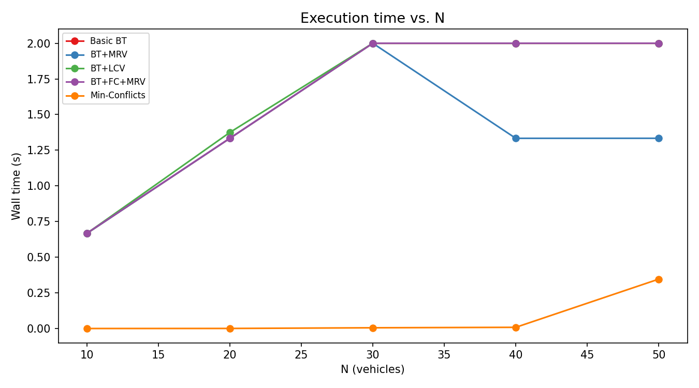
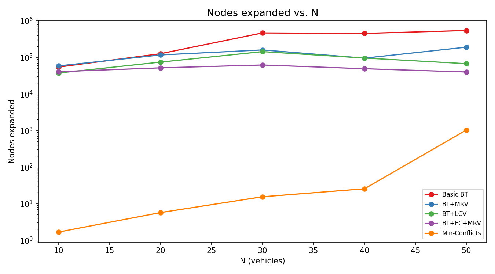
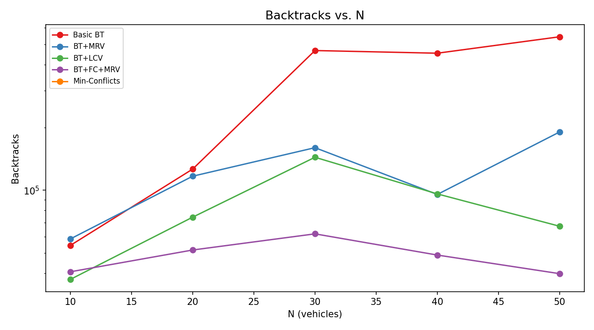
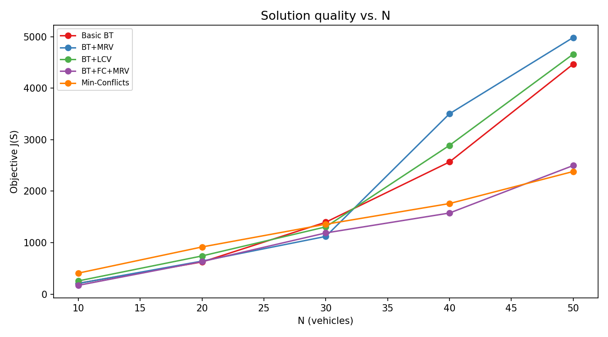
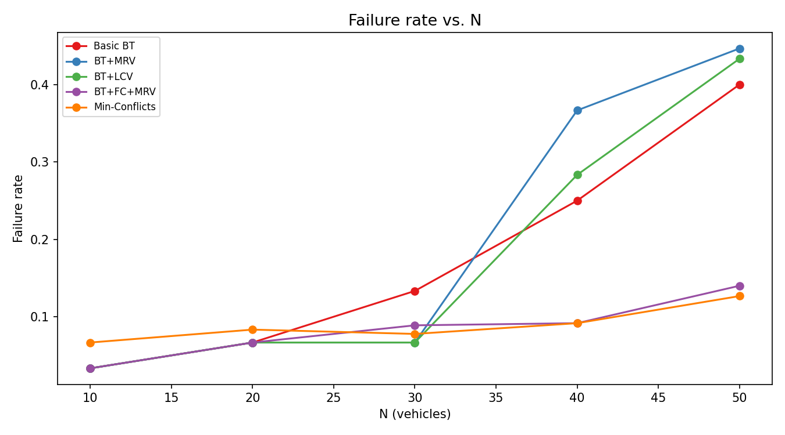
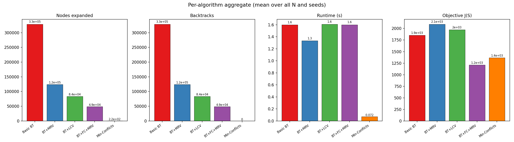

# Fuel Crisis CSP/COP — Results Report

## Problem definition

**Variables** — one per vehicle. **Domain** — feasible (station, pump, slot) triples.

**Hard constraints**
1. Fuel-type compatibility
2. Reachability (vehicle range ≥ road distance to station)
3. Pump exclusivity — no two vehicles share the same (station, pump, slot)
4. Supply capacity — cumulative demand ≤ station reserve per fuel type
5. Operating hours / vehicle time windows

**Soft objective J(S)** (COP)
```
J = w_dist · total_distance
  + w_wait · total_wait_time
  + w_prio · priority_penalty  (ambulances penalised quadratically for late slots)
  + w_unassigned · #unassigned_vehicles
```

## Algorithms

| ID | Algorithm | Key improvement |
|---|---|---|
| 1 | Basic Backtracking | Baseline — input order, no heuristics |
| 2 | BT + MRV | Degree tie-break uses precomputed constraint graph |
| 3 | BT + LCV | Least constraining value — max downstream options |
| 4 | BT + FC + MRV | Forward checking with O(1) supply check per value |
| 5 | BT + CBJ + FC + MRV | **New** Conflict-Directed Backjumping — jumps to culprit |
| 6 | BT + AC-3 + MRV | **New** Arc consistency preprocessing before search |
| 7 | Min-Conflicts | Local search with **tabu list** to avoid cycling |

## Scalability plots








## Summary table (mean over seeds)

| algorithm          |   n |   runtime_s_mean |   runtime_s_std |   nodes_mean |   backtracks_mean |   backjumps_mean |   constraint_checks_mean |   objective_mean |   objective_std |   failure_rate_mean |   success_rate |
|:-------------------|----:|-----------------:|----------------:|-------------:|------------------:|-----------------:|-------------------------:|-----------------:|----------------:|--------------------:|---------------:|
| basic_backtracking |  10 |      0.666779    |     1.15463     |  24611.3     |           24602   |            0     |              24611.3     |          210.266 |         40.6962 |           0.0333333 |       0.666667 |
| basic_backtracking |  20 |      1.33364     |     1.1542      |  65500.3     |           65481.7 |            0     |              65500.3     |          625.167 |        191.959  |           0.0666667 |       0.333333 |
| basic_backtracking |  30 |      2.00003     |     2.06382e-05 | 245126       |          245100   |            0     |             245126       |         1414.7   |        627.653  |           0.133333  |       0        |
| basic_backtracking |  40 |      2.00003     |     1.5252e-05  | 244834       |          244805   |            0     |             244834       |         2567.93  |        984.077  |           0.25      |       0        |
| basic_backtracking |  50 |      2.00006     |     6.32609e-05 | 348630       |          348601   |            0     |             348630       |         4467.93  |        883.839  |           0.4       |       0        |
| bt_ac3_mrv         |  10 |      0.669211    |     1.15014     |  40519       |           40509.3 |            0     |              40519       |          171.161 |         41.9886 |           0.0333333 |       0.666667 |
| bt_ac3_mrv         |  20 |      1.33676     |     1.13389     |  50514.7     |           50496   |            0     |              50514.7     |          575.698 |        167.388  |           0.0666667 |       0.333333 |
| bt_ac3_mrv         |  30 |      1.9826      |     0.00348022  |  52376.3     |           52349.7 |            0     |              52376.3     |         1311.66  |        716.029  |           0.1       |       0        |
| bt_ac3_mrv         |  40 |      1.95891     |     0.00833056  |  28984.3     |           28949.3 |            0     |              28984.3     |         1864.47  |        525.263  |           0.116667  |       0        |
| bt_ac3_mrv         |  50 |      1.92574     |     0.00774413  |  11349.7     |           11308.3 |            0     |              11349.7     |         2612.77  |       1039.98   |           0.153333  |       0        |
| bt_cbj_fc_mrv      |  10 |      0.667466    |     1.15403     |  36028.7     |           36003.3 |          710     |              36028.7     |          171.161 |         41.9886 |           0.0333333 |       0.666667 |
| bt_cbj_fc_mrv      |  20 |      1.33423     |     1.15326     |  41412       |           41393.3 |          789.333 |              41412       |          632.489 |        112.852  |           0.0666667 |       0.333333 |
| bt_cbj_fc_mrv      |  30 |      2.00012     |     1.59643e-05 |  43635.3     |           42789   |         2030.33  |              43635.3     |         1048.65  |        245.422  |           0.0666667 |       0        |
| bt_cbj_fc_mrv      |  40 |      2.00023     |     6.10283e-05 |  34884.7     |           34847.7 |         1182.67  |              34884.7     |         1476.96  |        181.794  |           0.0833333 |       0        |
| bt_cbj_fc_mrv      |  50 |      2.00028     |     7.06934e-05 |  23203       |           23163.3 |         1791     |              23203       |         2926.73  |       1866.98   |           0.213333  |       0        |
| bt_fc_mrv_deg      |  10 |      0.667496    |     1.154       |  37618.7     |           37609.3 |            0     |              37618.7     |          171.161 |         41.9886 |           0.0333333 |       0.666667 |
| bt_fc_mrv_deg      |  20 |      1.33424     |     1.15325     |  46750       |           46731.3 |            0     |              46750       |          632.489 |        112.852  |           0.0666667 |       0.333333 |
| bt_fc_mrv_deg      |  30 |      2.00012     |     1.2061e-05  |  50348.7     |           50321.3 |            0     |              50348.7     |         1188.83  |        477.164  |           0.0888889 |       0        |
| bt_fc_mrv_deg      |  40 |      2.00018     |     1.77957e-05 |  37543.3     |           37507.3 |            0     |              37543.3     |         1575.6   |        299.076  |           0.0916667 |       0        |
| bt_fc_mrv_deg      |  50 |      2.00029     |     5.76656e-05 |  31579       |           31536   |            0     |              31579       |         2497.67  |        984.995  |           0.14      |       0        |
| bt_lcv             |  10 |      0.667424    |     1.1541      |  32237.3     |           32227.7 |            0     |              32237.3     |          257.224 |         39.9042 |           0.0333333 |       0.666667 |
| bt_lcv             |  20 |      1.38375     |     1.06742     |  59575.7     |           59557   |            0     |              59575.7     |          742.137 |        177.143  |           0.0666667 |       0.333333 |
| bt_lcv             |  30 |      2.00003     |     5.36473e-06 | 114688       |          114660   |            0     |             114688       |         1306.48  |        177.998  |           0.0666667 |       0        |
| bt_lcv             |  40 |      2.00004     |     3.71953e-06 |  79348       |           79319.7 |            0     |              79348       |         2889.35  |       1897.75   |           0.283333  |       0        |
| bt_lcv             |  50 |      2.00019     |     0.000235563 |  75740.7     |           75713   |            0     |              75740.7     |         4660.47  |       2593.85   |           0.433333  |       0        |
| bt_mrv             |  10 |      0.66683     |     1.15457     |  58618.7     |           58609   |            0     |              58618.7     |          208.449 |         36.4784 |           0.0333333 |       0.666667 |
| bt_mrv             |  20 |      1.33366     |     1.15416     |  82332       |           82313.7 |            0     |              82332       |          642.244 |        181.048  |           0.0666667 |       0.333333 |
| bt_mrv             |  30 |      2.00004     |     3.51774e-05 | 119734       |          119706   |            0     |             119734       |         1121.05  |        125.094  |           0.0666667 |       0        |
| bt_mrv             |  40 |      1.33364     |     1.15423     |  72725.3     |           72701.3 |            0     |              72725.3     |         3503.01  |       3447.72   |           0.366667  |       0        |
| bt_mrv             |  50 |      1.33385     |     1.15393     | 169910       |          169884   |            0     |             169910       |         4984.17  |       3939.31   |           0.446667  |       0        |
| min_conflicts      |  10 |      0.000232154 |     0.000250932 |      1.66667 |               0   |            0     |                  2.66667 |          408.835 |        137.876  |           0.0666667 |       0.333333 |
| min_conflicts      |  20 |      0.00090634  |     0.000630602 |      5.66667 |               0   |            0     |                  6.66667 |          916.703 |         84.804  |           0.0833333 |       0        |
| min_conflicts      |  30 |      0.00395279  |     0.00314833  |     15.3333  |               0   |            0     |                 16.3333  |         1357.15  |        177.942  |           0.0777778 |       0        |
| min_conflicts      |  40 |      0.0103035   |     0.00606109  |     25.3333  |               0   |            0     |                 26.3333  |         1759.76  |        346.956  |           0.0916667 |       0        |
| min_conflicts      |  50 |      0.614492    |     1.01849     |   1028.67    |               0   |            0     |               1029.33    |         2381.98  |        776.849  |           0.126667  |       0        |

## Key observations

- **Fewest nodes expanded**: `min_conflicts` (avg 215 nodes)
- **Fewest backtracks**: `min_conflicts` (avg 0 backtracks)
- **Best solution quality**: `bt_fc_mrv_deg` (avg J=1213.2)
- **Most nodes (baseline)**: `basic_backtracking` (avg 185740 nodes) — illustrates exponential blow-up without heuristics.

CBJ eliminates thrashing by jumping past irrelevant variables; AC-3 preprocessing reduces domain sizes before the first node is expanded.